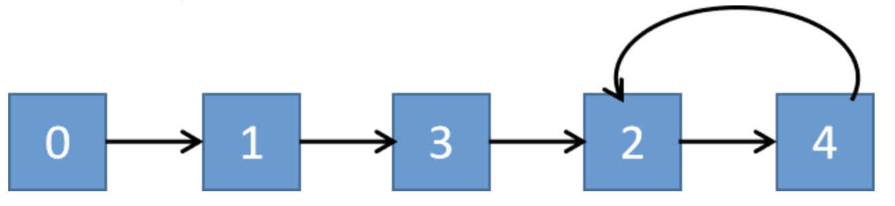

# 寻找重复数

### 题目

给定一个包含 *n* + 1 个整数的数组 *nums*，其数字都在 1 到 *n* 之间（包括 1 和 *n*），可知至少存在一个重复的整数。假设只有一个重复的整数，找出这个重复的数。

**示例 1:**

```
输入: [1,3,4,2,2]
输出: 2
```

**示例 2:**

```
输入: [3,1,3,4,2]
输出: 3
```

**说明：**

1. **不能**更改原数组（假设数组是只读的）。
2. 只能使用额外的 *O*(1) 的空间。
3. 时间复杂度小于 *O*(*n*2) 。
4. 数组中只有一个重复的数字，但它可能不止重复出现一次。


### 解法

将数组看作链表：下标为i的节点的下一个节点为下标为nums[i]的节点。例如，数组`[1,3,4,2,2]`可以看作链表：0 -> 1 -> 3 -> 2 -> 4 -> 2 -> 4 -> 2...



可以看到，若数组中没有重复的数字，那么下标是不会重复的，但如果是存在重复的数字，那么就会形成循环，即链表出现了环。那么此时我们就可以使用寻找链表环入口的方法解决这个问题，环入口的值即为重复的数字。

寻找链表环入口的方法：快慢指针。

```c++
class Solution {
public:
    int findDuplicate(vector<int>& nums) {
        int slow = 0, fast = 0;
        slow = nums[slow];
        fast = nums[nums[fast]];
        
        while(slow != fast){
            slow = nums[slow];
            fast = nums[nums[fast]];
        }

        int ptr1 = 0, ptr2 = slow;
        while(ptr1 != ptr2){
            ptr1 = nums[ptr1];
            ptr2 = nums[ptr2];
        }
        return ptr1;
    }
};
```


